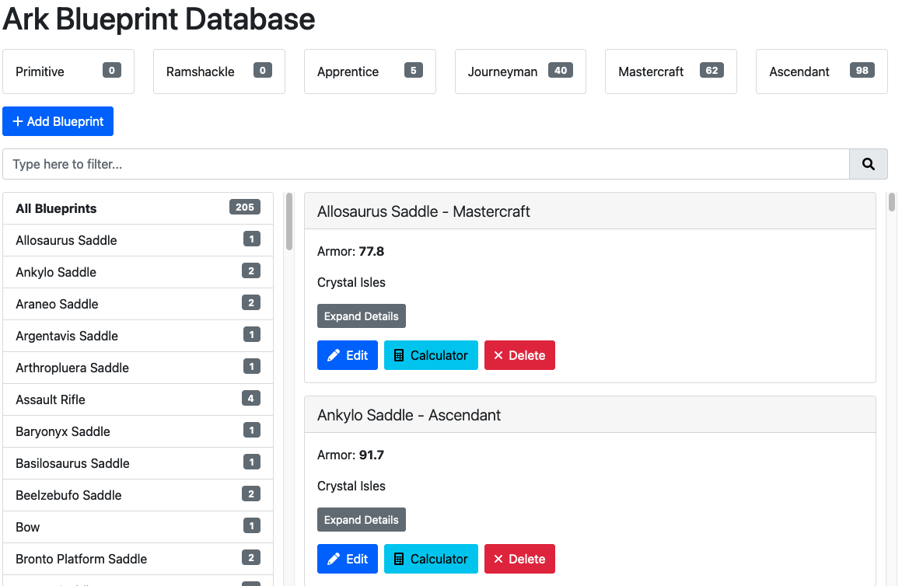
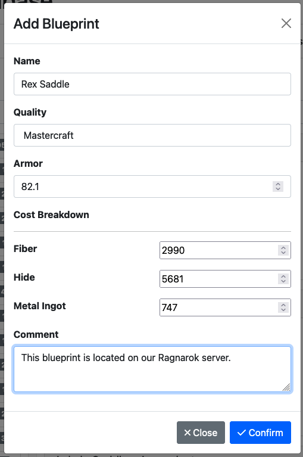

# Ark Blueprint Tracker

This project is to help you keep track of all your tribe's [blueprints with quality](https://ark.wiki.gg/wiki/Blueprints) in the video game ARK: Survival Evolved.

Track blueprint armor, durability, and damage statistics, as is relevant.

See below for screenshots.

Features:
- An always-visible summary of the count of each item quality blueprints you have (e.g. Ascendant, Mastercraft, etc.)
- Blueprints grouped by item
- See how many blueprints of each type your tribe has
- Many possible blueprints with quality pre-populated in a user-friendly searchable list.
- Which materials required to craft an item pre-populated, simply enter the required number of materials.
- Show how many stacks of each material you will need to create the blueprint. To know at-a-glance if you can craft in Smithy / Fabricator / etc.
- Built-in calculator if you need to craft multiples of a blueprint to tell you exactly how many materials you will need.
- Leave a comment on each blueprint; who has it, which server it's on, which base it's at, etc.
- Blueprints search

## Technology Stack

This project utilizes the Create React App project, uses React and Bootstrap 5.

## Running

This project is a frontend only, and I am currently using [json-server](https://www.npmjs.com/package/json-server) as the backend.

```json-server data.json --host 0.0.0.0 --p 3001 --id uuid```

## Screenshots





## License

Copyright &copy; 2022 John Nahlen.

`MIT`

See `LICENSE.txt`.